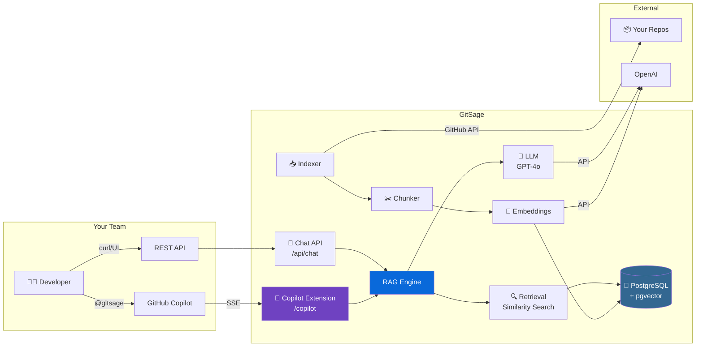

<div align="center">

# 🧙‍♂️ GitSage

### *A sage that knows your codebase*

**Index your entire GitHub org → Ask questions about your code → Get AI-powered answers with source citations**

[](https://github.com/rameshreddy-adutla/gitsage/actions/workflows/ci.yml)
[](https://opensource.org/licenses/MIT)
[](https://openjdk.org/projects/jdk/21/)
[](https://micronaut.io/)
[](https://docs.github.com/en/copilot/building-copilot-extensions)
[](https://www.docker.com/)

<br/>

[Quick Start](#-quick-start) •
[Features](#-features) •
[Architecture](#-architecture) •
[Copilot Extension](#-copilot-extension) •
[Configuration](#%EF%B8%8F-configuration) •
[Contributing](#-contributing)

<br/>

</div>

---

## 💡 What is GitSage?

GitSage is a **self-hosted RAG (Retrieval-Augmented Generation) bot** that indexes your GitHub organisation's repositories and lets you chat with your codebase. It understands your code, READMEs, issues, and development patterns — and cites its sources.

**Works as a GitHub Copilot Extension** — type `@gitsage` in Copilot Chat and ask anything about your org's code.

```
You:      @gitsage how does authentication work in our services?

GitSage:  Based on the codebase, authentication is handled by the `auth-service` 
          repository using JWT tokens...
          
          📁 auth-service/src/main/java/com/example/AuthController.java
          📁 auth-service/src/main/java/com/example/JwtTokenProvider.java
          
          The flow is: Login → Validate credentials → Issue JWT → Store in 
          HTTP-only cookie → Verify on subsequent requests via JwtAuthFilter...
```

## ✨ Features

| Feature | Description |
|---------|-------------|
| 🔍 **Full Org Indexing** | Crawls all repos — READMEs, source code, issues |
| 🧠 **RAG-Powered Chat** | Answers grounded in your actual code, not hallucinations |
| 🤖 **Copilot Extension** | `@gitsage` in GitHub Copilot Chat (VS Code, JetBrains, github.com) |
| 📡 **Streaming Responses** | Real-time SSE streaming for both REST API and Copilot |
| 🔄 **Incremental Indexing** | Only re-indexes changed files (content hash tracking) |
| ⏰ **Scheduled Re-indexing** | Configurable cron-based automatic updates |
| 🐘 **pgvector Storage** | HNSW-indexed vectors in PostgreSQL — no extra infra |
| 🐳 **One-Command Setup** | `docker compose up` and you're running |
| 🔒 **Signature Verification** | Cryptographic webhook verification for Copilot requests |
| 📊 **REST API** | Full HTTP API for chat, indexing, and status |

## 🏗 Architecture



> 📖 See [docs/architecture.md](docs/architecture.md) for detailed sequence diagrams and design decisions.

## 🚀 Quick Start

### Prerequisites
- Docker & Docker Compose
- GitHub Personal Access Token ([create one](https://github.com/settings/tokens) with `repo` read access)
- OpenAI API key ([get one](https://platform.openai.com/api-keys))

### 1. Clone and configure

```bash
git clone https://github.com/rameshreddy-adutla/gitsage.git
cd gitsage

# Create your environment file
cat > .env << EOF
GITHUB_TOKEN=ghp_your_token_here
GITHUB_ORG=your-org-name
OPENAI_API_KEY=sk-your-key-here
EOF
```

### 2. Start everything

```bash
docker compose -f docker/docker-compose.yml --env-file .env up -d
```

That's it. GitSage is running at `http://localhost:8080`.

### 3. Index your org

```bash
# Trigger initial indexing
curl -X POST http://localhost:8080/api/index

# Check progress
curl http://localhost:8080/api/index/status
```

### 4. Ask questions

```bash
# Chat with your codebase
curl -X POST http://localhost:8080/api/chat \
  -H "Content-Type: application/json" \
  -d '{"question": "How is error handling implemented across our services?"}'
```

### 5. Stream responses

```bash
# Real-time streaming
curl -N -X POST http://localhost:8080/api/chat/stream \
  -H "Content-Type: application/json" \
  -d '{"question": "What design patterns are used in the codebase?"}'
```

## 🤖 Copilot Extension

The killer feature — use GitSage directly inside GitHub Copilot Chat.

### Setup

1. Register a GitHub App with Copilot Extension support
2. Point the webhook URL to `https://your-domain.com/copilot`
3. Install the app on your organisation

> 📖 Full setup guide: [docs/copilot-extension-setup.md](docs/copilot-extension-setup.md)

### Usage

Once installed, any developer in your org can:

```
@gitsage what does the payment service do?
@gitsage show me how we handle database migrations
@gitsage which repos use Spring Security?
@gitsage explain the CI/CD pipeline in the platform repo
```

## 🛠️ Configuration

GitSage is configured via environment variables:

| Variable | Required | Description | Default |
|----------|----------|-------------|---------|
| `GITHUB_TOKEN` | ✅ | GitHub PAT (read-only) | — |
| `GITHUB_ORG` | ✅ | GitHub org to index | — |
| `OPENAI_API_KEY` | ✅ | OpenAI API key | — |
| `POSTGRES_HOST` | ❌ | Database host | `localhost` |
| `POSTGRES_PORT` | ❌ | Database port | `5432` |

> 📖 Full configuration reference: [docs/configuration.md](docs/configuration.md)

## 📊 API Reference

| Endpoint | Method | Description |
|----------|--------|-------------|
| `/api/chat` | `POST` | Chat with your codebase (JSON response) |
| `/api/chat/stream` | `POST` | Streaming chat (SSE) |
| `/api/index` | `POST` | Trigger full org indexing |
| `/api/index/{repo}` | `POST` | Index a single repository |
| `/api/index/status` | `GET` | Get indexing status |
| `/copilot` | `POST` | Copilot Extension endpoint (SSE) |
| `/health` | `GET` | Health check |

## 🧪 Development

```bash
# Start PostgreSQL
docker compose -f docker/docker-compose.yml up -d postgres

# Set environment variables
export GITHUB_TOKEN=ghp_xxx
export GITHUB_ORG=your-org
export OPENAI_API_KEY=sk-xxx

# Run tests
./gradlew test

# Run locally
./gradlew run
```

## 🗺️ Roadmap

- [ ] **Ollama support** — local LLM without API keys
- [ ] **Web UI** — browser-based chat interface
- [ ] **Multi-org support** — index multiple organisations
- [ ] **GitHub Discussions** — index discussion threads
- [ ] **PR review context** — understand review comments
- [ ] **GraalVM native image** — instant startup, minimal memory
- [ ] **Slack/Teams integration** — chat from your team channels

## 🤝 Contributing

Contributions are welcome! Please read the [Contributing Guide](CONTRIBUTING.md) before submitting a PR.

## 📄 License

MIT — see [LICENSE](LICENSE) for details.

---

<div align="center">

**Built with ☕ Java 21 • 🧩 Micronaut 4 • 🦜 LangChain4j • 🐘 PostgreSQL + pgvector**

⭐ **Star this repo** if GitSage helps your team understand their codebase better!

</div>
