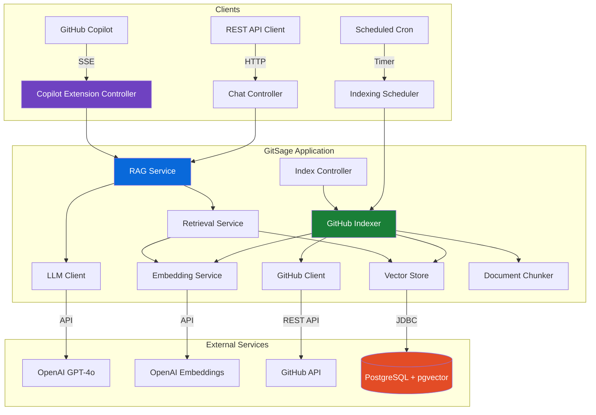
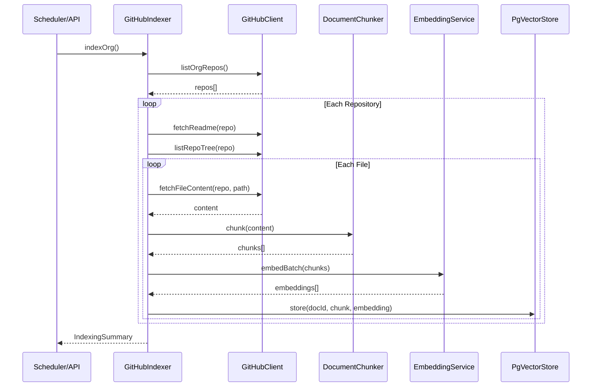
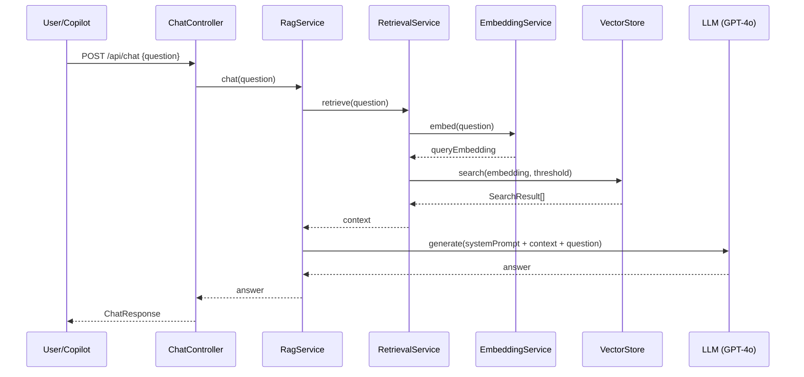

# Architecture

GitSage follows a clean, layered architecture designed for extensibility and maintainability.

## High-Level Architecture

## Data Flow

### Indexing Pipeline

### RAG Query Pipeline

## Package Structure

| Package | Responsibility |
|---------|---------------|
| `dev.gitsage.config` | Application configuration (records, type-safe) |
| `dev.gitsage.github` | GitHub API client, indexer, document model |
| `dev.gitsage.embedding` | Document chunking, embedding generation |
| `dev.gitsage.store` | Vector store interface and pgvector implementation |
| `dev.gitsage.rag` | RAG orchestration, retrieval, prompt templates |
| `dev.gitsage.api` | REST API controllers (Chat, Index) |
| `dev.gitsage.copilot` | GitHub Copilot Extension protocol implementation |

## Key Design Decisions

### Why Micronaut?
- Faster startup than Spring Boot (critical for containerised deployments)
- Lower memory footprint
- GraalVM native image support for future optimisation
- Compile-time DI (no reflection overhead)

### Why pgvector?
- No additional infrastructure — runs inside PostgreSQL
- Excellent HNSW index performance for similarity search
- Mature ecosystem with JDBC support
- One less service to manage vs dedicated vector DBs

### Why LangChain4j?
- Java-native RAG framework (no Python dependency)
- Swappable providers (OpenAI, Ollama, HuggingFace)
- Built-in streaming support
- Active community and frequent releases

### Why OpenAI-compatible SSE for Copilot?
- GitHub Copilot Extensions use the OpenAI chat completions streaming format
- Enables drop-in compatibility with any OpenAI-compatible client
- Future-proof for protocol evolution
