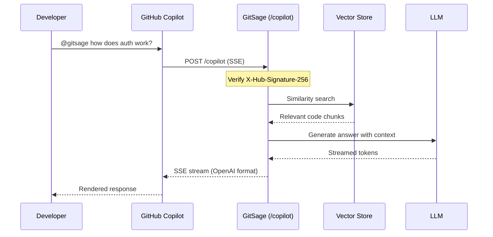

# Setting Up GitSage as a GitHub Copilot Extension

This guide walks you through registering GitSage as a GitHub Copilot Extension,
so your team can `@gitsage` directly in Copilot Chat.

## Prerequisites

- GitSage deployed and accessible via a public URL (or tunnel)
- A GitHub account with permission to create GitHub Apps
- HTTPS endpoint (GitHub requires SSL for webhooks)

## Step 1: Create a GitHub App

1. Go to **Settings** → **Developer settings** → **GitHub Apps** → **New GitHub App**
2. Fill in:
   - **App name**: `GitSage` (or your preferred name)
   - **Homepage URL**: Your GitSage deployment URL
   - **Webhook URL**: `https://your-domain.com/copilot`
   - **Webhook secret**: Generate a secure random string
3. Under **Permissions**, set:
   - **Copilot Chat**: Read & Write
4. Click **Create GitHub App**

## Step 2: Configure as Copilot Extension

1. In your GitHub App settings, go to **Copilot** tab
2. Set:
   - **App Type**: Agent
   - **URL**: `https://your-domain.com/copilot`
   - **Inference description**: "Ask questions about your organisation's codebase"
3. Save changes

## Step 3: Install the App

1. Go to your GitHub App's page
2. Click **Install App**
3. Select your organisation
4. Grant access to the repositories you want

## Step 4: Configure GitSage

Set the webhook secret in your GitSage environment:

```bash
export COPILOT_WEBHOOK_SECRET=your-webhook-secret-from-step-1
```

Or in `docker-compose.yml`:

```yaml
services:
  gitsage:
    environment:
      - COPILOT_WEBHOOK_SECRET=your-webhook-secret
```

## Step 5: Test It

1. Open GitHub Copilot Chat (in VS Code, JetBrains, or github.com)
2. Type `@gitsage how does authentication work in our codebase?`
3. GitSage will:
   - Receive the message via the Copilot Extension protocol
   - Search its vector store for relevant code
   - Stream a RAG-augmented response back to Copilot

## Architecture



## Local Development

For local testing, use a tunnel to expose your local GitSage:

```bash
# Using ngrok
ngrok http 8080

# Or using cloudflared
cloudflared tunnel --url http://localhost:8080
```

Set the tunnel URL as your GitHub App's webhook URL.

## Troubleshooting

| Problem | Solution |
|---------|----------|
| 401 Unauthorized | Check webhook secret matches between GitHub App and `COPILOT_WEBHOOK_SECRET` |
| No response | Verify GitSage is accessible at the configured URL |
| Slow responses | Check indexing status at `GET /api/index/status` — empty vector store = no context |
| Irrelevant answers | Lower `similarity-threshold` or increase `max-results` |
